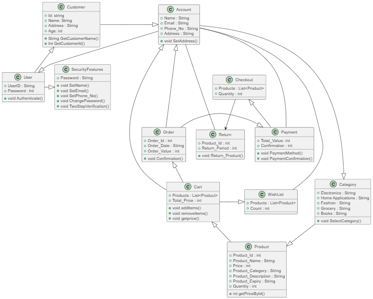
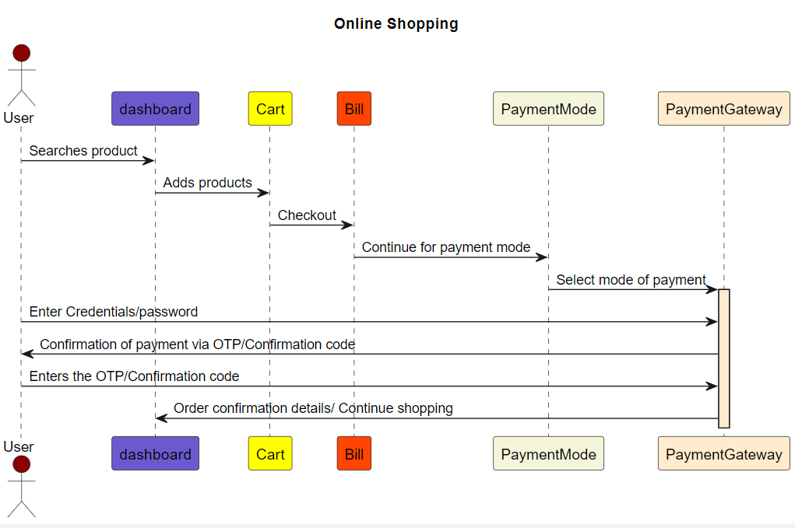

# **Online Shopping System**

## Online Shopping UML Design: 

The UML Design describes the high-level design structure and relationships between various entities and components within the Online Shopping System. 

## UML Diagram Overview: 

**User**: It represents the user's login into the shopping system with the credentials. 

**Customer**: It manages the user by the ID allocated to each of the users, and it includes information about the name, address, age, etc. 

**Account**: It manages the contact details of the customer, and it can be used to change the customer's phone number and email address. 

**Category**: It provides easier access to the required products to be picked up by the customer. 

**Product**: It represents the products that are available in the online store. It includes information about the product such as name, ID, price, manufacture date, etc. 

**Cart**: It represents the virtual cart where the user can put the products in the cart. It makes it easier for the user to check out the products. 

**Checkout**: It includes the list of the products to be checked out and the quantity to be checked out. 

**Order**: It is used to track and manage the order by the id of the order, and it includes information such as the date and value of the order. 

**Return**: It used to track the period the product was eligible for return. 

**Payment**: It includes the payment mode and process that returns the confirmation message for the successful payment. 

**Security Features**: It provides control features for the user to change the password, name, phone number, etc. 

## UML Diagram Flow: 

### [Task 1](https://github.com/aristovince31/UML/tree/master/Task1)(Class Diagram):

First, the user must validate the login by entering the correct password. Then the user profile is changed to customer, which consists of the ID, name, address, etc. 

The user is added to several security features that enable the customer to change the password, change the email address, change the phone number, etc. 

Second, the user can use the account details to place an order for the products that are required. Accounts act as an interface to provide a better shopping experience. 

By using the account, we can be able to select the category to easily pick the products for customer purposes. 

By selecting the category, you can easily pick the product consisting of ID, name, price, description, expiration date, etc. Products can be added to the cart and linked to the account for future reference. 

The shopping cart consists of the following entities: list of products, total value, and methods: add Items, remove items, and get Price. 

From the cart, it is moved to the Order or Wishlist. The order consists of the following entities: ID, date, value, and confirmation. The Wishlist consists of a list of products. 

The wishlist is linked to the account to save the products in the account. The order can be further processed on the payment page, which consists of the mode of payment and confirmation for the payment. 

Once the payment is completed, the products are checked out, and it is used to track the order status. 

It will initialize the return option for a specific period to return the products if the customer is not satisfied. 

### [Task 2](https://github.com/aristovince31/UML/tree/master/Task2) (Use Case Diagram):

In the Online Shopping Management System, there are four actors included. 

**Customer**: Represents the users who browse and purchase products. 
**Administrator**: Manages product listings, inventory, and handles customer support. 
**Dealer**: Handles order processing and shipping.  
**System User**: Manages product availability and stock levels. 

### [Task 3](https://github.com/aristovince31/UML/tree/master/Task3)(Sequence Diagram):

The user must login into their account and must search the required product. After the user is done with choosing the required product, one must add that to their cart.  

Checking out the products is the next step which then calculates the total bill for our purchase. The following step now is to continue and choose the payment mode to pay the bill.  

The next step is in the payment gateway, the user has to enter therequired credentials to receive the confirmation code. After verification of the confirmation code, the order is confirmed and is placed. For further shopping, the user is redirected to the dashboard for furthermore shopping. 

### UML TOOLS: 

The UML Tools that are used are PlantUML. PlantUML was used to convert the code into a pictorial representation. The UML file is saved as .puml. 

### VERSION CONTROL: 

The UML diagram can be tracked by the version control system in Git. The changes in the UML diagram should be used in the software development phase. It makes things easier in the development phase. 

### CONCLUSION: 
The UML Diagram provides a pictorial representation of the design and structure of online shopping. It provides a better understanding of the functionalities and components of the architecture of online shopping. It was simpler to collaborate with the team members in the software development cycle. 
